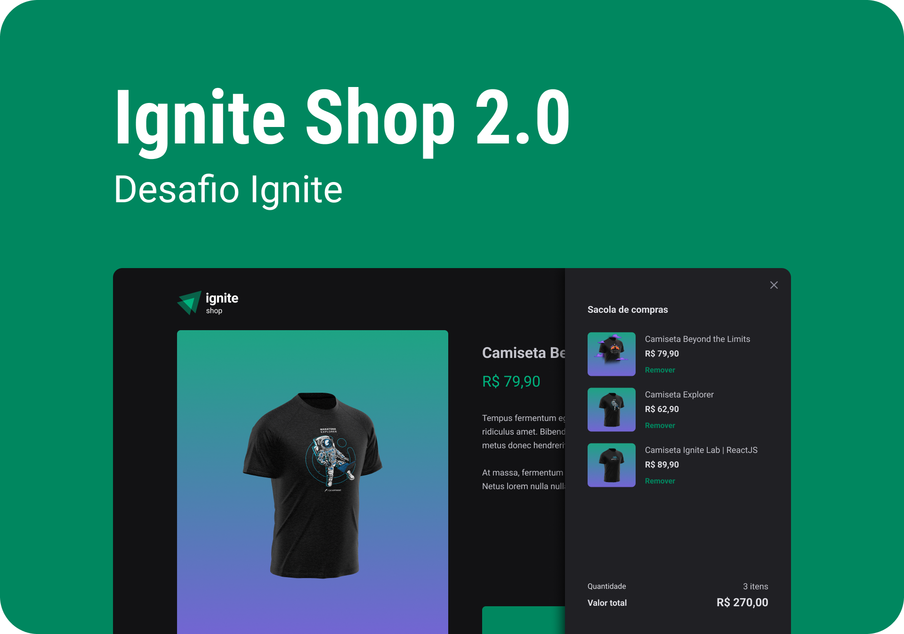

# Desafio - Rocketseat Ignite 2022 - React

[ Link do Figma ](https://www.figma.com/file/yCIQoJe1IM296dZ2tMamml/Ignite-Shop-2.0-(Copy))

## 👨‍💻 Sobre este repositório

Esse repositório contém uma pequena aplicação de e-commerce que integração com a plataforma de pagamentos Stripe.

O desafio proposto foi aproveitar a aplicação que já havia sido desenvolvida na trilha para implementar um carrinho de compras que utiliza os dados da API do Stripe para carregar os produtos, e controlar o número de itens que a pessoa deseja comprar.

Além de implementar as funcionalidades conforme foi solicitado busquei replicar a interface respeitando as especificações do layout, contudo aprimorando detalhes que valorizam a navegação e a experiência do usuário, como por exemplo hover effects e transitions no modal do carrinho e navegação por setas no carrousel da página inicial.

----

## 💻 Sobre o desafio

O desafio é parte dos execícios da atualização 2022 do curso Ignite da Rocketseat e faz parte da trilha de React. Esse desafio envolve conhecimentos sólidos de hooks, context API, Stitches e Radix UI. 